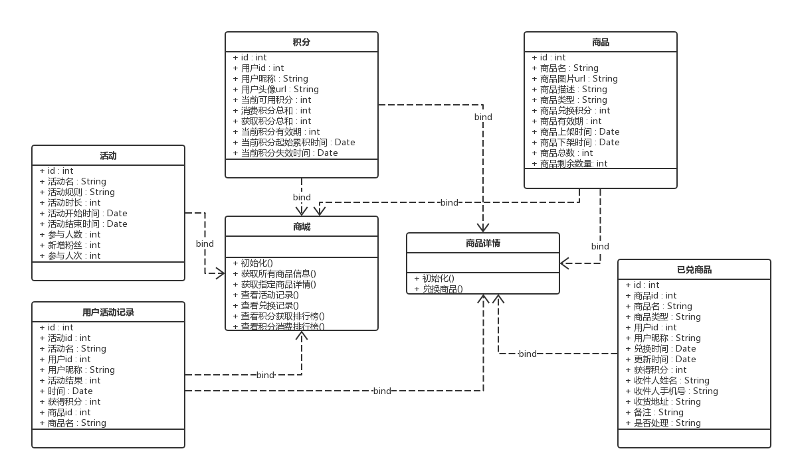
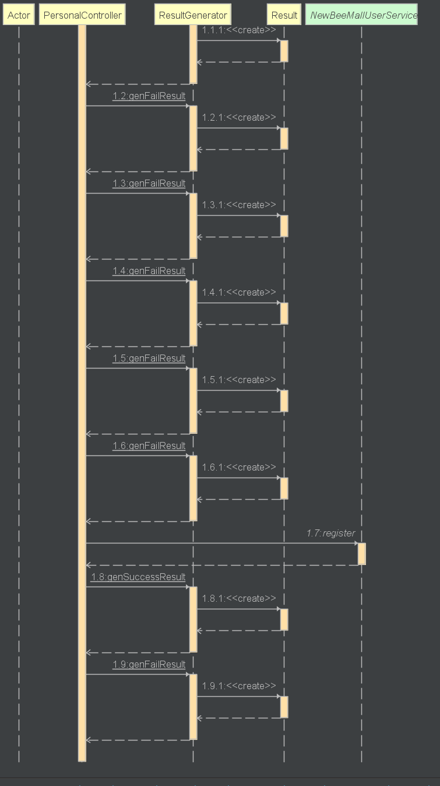
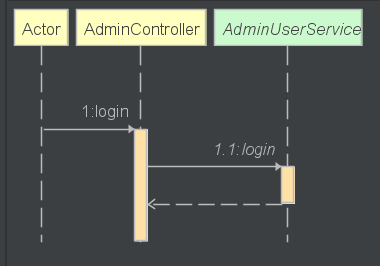
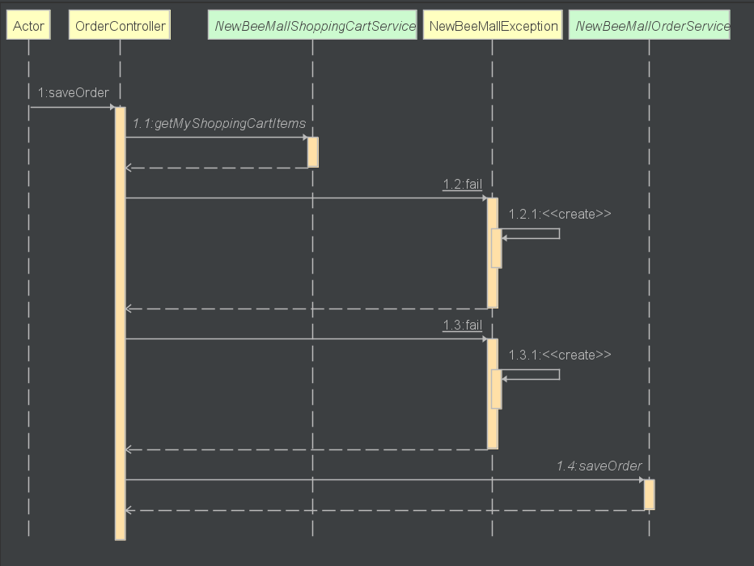
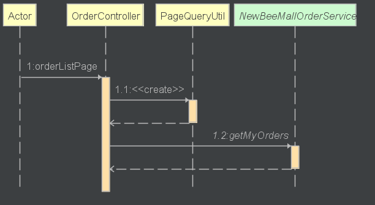
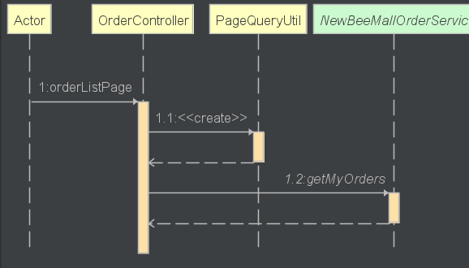
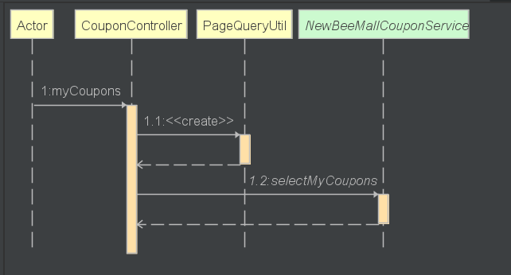
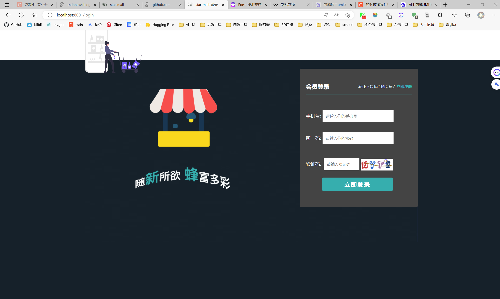
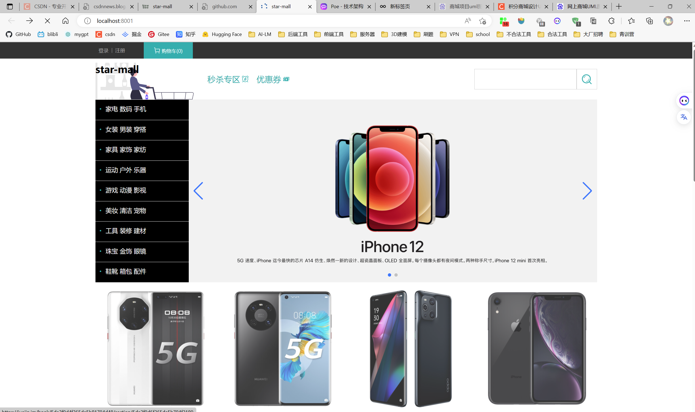

# 小星商城——star-mall

## Getting Started

在运行此项目之前，你需要先安装Mysql8.0+、Redis3.0+、Jdk17+、Maven3.5+环境

- First,克隆项目并导入相关依赖

使用idea打开star-mall项目，导入maven依赖

- Second, 导入sql文件

在项目根目录下sql文件夹下，找到`star-mall-scheme.sql`、`秒杀存储过程.sql`文件，新建mysql数据库newbee_mall_plus_db，导入其中

- 解压项目图片

将项目根目录下upload.zip文件加压缩到D盘upload文件夹中，eg:D:\\upload

- 修改Mysql、Redis连接配置

修改`application-dev.yml`文件中数据连接配置相关信息

- 启动项目

找到`NewBeeMallPlusApplication`文件，右键`run AdminApplication`，启动项目

- 访问

打开浏览器输入：http://localhost:8001/index.html

## 技术架构

1. 后端技术栈：

    - Spring Boot：用于构建后端应用程序的框架。
    - MySQL 8.0+：关系型数据库，用于持久化数据。
    - Redis 3.0+：内存缓存数据库，用于高速缓存和提高系统性能。
    - JDK 17+：Java开发工具包，提供核心的Java开发功能。
    - Maven 3.5+：项目构建工具，用于管理项目依赖和构建过程。

2. 前端技术栈：

    - HTML/CSS/JavaScript：前端开发的基础技术。
    - 前端模板引擎：如Thymeleaf或FreeMarker，用于生成动态的HTML页面。
    - jQuery/Ajax：用于简化前端开发和实现异步请求。
    - Bootstrap或其他CSS框架：用于快速构建响应式布局和美观的界面。

3. 架构设计：

    - MVC架构：使用Spring MVC作为后端的Web框架，将应用程序划分为模型、视图和控制器。
    - RESTful API：通过设计和实现RESTful风格的API接口，实现前后端数据交互和业务逻辑处理。
    - 数据访问层（DAO）：使用Spring Data JPA或MyBatis等持久层框架，实现与数据库的交互和数据访问。
    - 业务逻辑层（Service）：封装业务逻辑，处理数据处理和业务规则。
    - 控制层（Controller）：接收和处理前端请求，协调业务逻辑的处理，并返回响应结果。
    - 缓存层：使用Redis作为缓存数据库，提高系统性能和响应速度。
    - 安全认证和权限控制：可以使用Spring Security等框架实现用户认证和权限管理。
    - 异步消息队列：可以使用RabbitMQ或Kafka等消息队列，实现异步任务处理和解耦。
    - 日志管理：使用日志框架，如Log4j或Logback，记录系统运行日志。
    - 单元测试和集成测试：使用JUnit等测试框架进行单元测试和集成测试，确保代码质量和功能稳定性。

## 项目结构
```angular2html
star-mall
├─.idea
│  └─dataSources
│      └─020f159c-aa36-4dbb-982c-eec103d7ff1a
│          └─storage_v2
│              └─_src_
│                  └─schema
├─images
├─src
│  └─main
│      ├─java
│      │  └─star
│      │      └─newbee
│      │          └─mall
│      │              ├─annotion
│      │              ├─common
│      │              ├─config
│      │              ├─controller
│      │              │  ├─admin
│      │              │  ├─common
│      │              │  ├─mall
│      │              │  └─vo
│      │              ├─dao
│      │              ├─entity
│      │              ├─exception
│      │              ├─redis
│      │              ├─service
│      │              │  └─impl
│      │              ├─task
│      │              ├─util
│      │              └─web
│      │                  ├─filter
│      │                  └─interceptor
│      └─resources
│          ├─mapper
│          ├─static
│          │  ├─admin
│          │  │  ├─dist
│          │  │  │  ├─css
│          │  │  │  ├─fonts
│          │  │  │  ├─img
│          │  │  │  └─js
│          │  │  │      └─plugins
│          │  │  │          ├─bootstrap
│          │  │  │          │  ├─css
│          │  │  │          │  └─js
│          │  │  │          ├─font-awesome
│          │  │  │          │  ├─css
│          │  │  │          │  └─fonts
│          │  │  │          └─jquery
│          │  │  └─plugins
│          │  │      ├─ajaxupload
│          │  │      ├─bootstrap
│          │  │      │  ├─css
│          │  │      │  ├─fonts
│          │  │      │  └─js
│          │  │      ├─daterangepicker
│          │  │      ├─jqgrid
│          │  │      ├─jquery
│          │  │      ├─select2
│          │  │      │  └─i18n
│          │  │      └─sweetalert
│          │  └─mall
│          │      ├─css
│          │      ├─fonts
│          │      ├─image
│          │      │  ├─pay
│          │      │  ├─sub_banner
│          │      │  └─swiper
│          │      ├─js
│          │      └─styles
│          └─templates
│              ├─admin
│              ├─error
│              └─mall
```
## UML类图



`主要商品类图`：
```gherkin
+-----------------------------------+
  |             ShoppingCart          |
  +-----------------------------------+
  | - items: List<CartItem>           |
  | - total: double                   |
  +-----------------------------------+
  | + addItem(item: Item, quantity: int) |
  | + removeItem(item: Item)          |
  | + updateQuantity(item: Item, quantity: int) |
  | + calculateTotal()                |
  +-----------------------------------+

      ^
      |
      |

  +-----------------------------------+
  |             CartItem               |
  +-----------------------------------+
  | - item: Item                      |
  | - quantity: int                   |
  | - subtotal: double                |
  +-----------------------------------+
  | + getItem()                       |
  | + getQuantity()                   |
  | + getSubtotal()                   |
  +-----------------------------------+

      ^
      |
      |

  +-----------------------------------+
  |               Item                |
  +-----------------------------------+
  | - id: int                         |
  | - name: String                    |
  | - price: double                   |
  +-----------------------------------+
  | + getId()                         |
  | + getName()                       |
  | + getPrice()                      |
  +-----------------------------------+
```

## 主要功能时序图

- 用户注册


- 用户登录


- 购买商品


- 查看商品列表


- 查看订单列表


- 查看购物车




## 主要功能演示

- 用户登录注册

- 商城页展示

